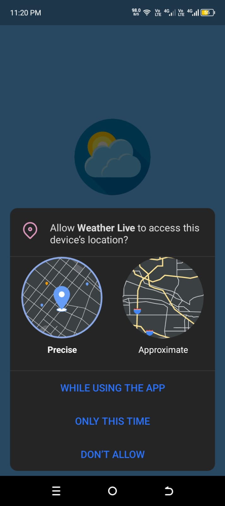
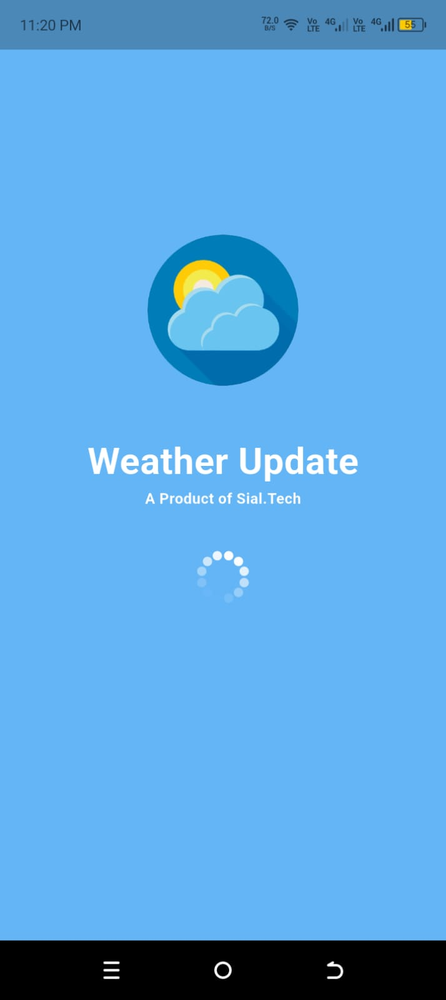
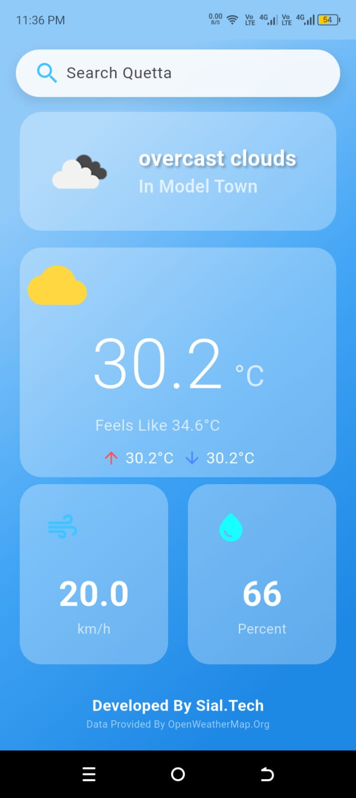

# 🌤️ Weather_Live

A modern Flutter weather application that provides real-time weather information using a weather API.

## 📱 Features

- 🌍 Current location weather
- 🔍 Search weather by city
- 🌡️ Real-time temperature
- 💧 Humidity information
- 💨 Wind speed
- 🌅 Sunrise & Sunset time
- 🔄 Pull-to-refresh
- 📱 Responsive UI
- ⚡ Fast and smooth performance

## 🛠️ Built With

- Flutter
- Dart
- REST API
- Geolocator
- HTTP Package
- Android Studio

## 📸 Screenshots






## 🚀 Getting Started

Clone the repository:

```bash
git clone https://github.com/AshrafSialDev/flutter_application_1.git
```

Install dependencies:

```bash
flutter pub get
```

Run the app:

```bash
flutter run
```

## 📂 Project Structure

```
lib/
 ├── Activity/
 ├── worker/
 ├── main.dart
```

## 👨‍💻 Developer

**Muhammad Ashraf**

- GitHub: https://github.com/AshrafSialDev
- LinkedIn: https://www.linkedin.com/in/muhammad-ashraf-as0956

## ⭐ Support

If you like this project, consider giving it a ⭐ on GitHub.